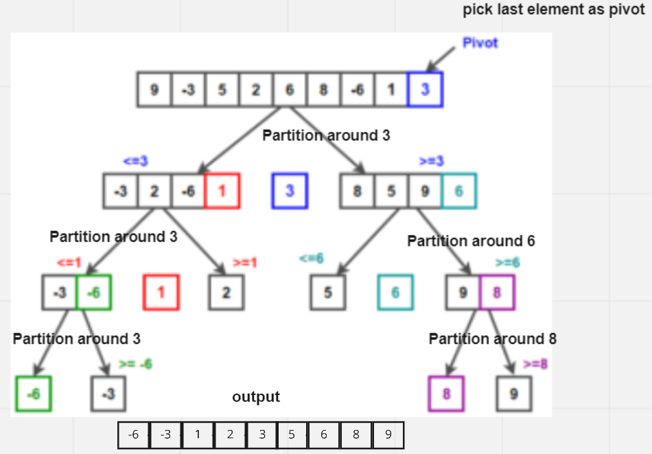

# Challenge Summary
implementation of Quick Sort based on the pseudocode provided.and trace the process step by step and make BLOG file
The key process in quickSort is partition(). Target of partitions is, given an array and an element x of array as pivot, put x at its correct position in sorted array and put all smaller elements (smaller than x) before x, and put all greater elements (greater than x) after x. All this should be done in linear time.

## Pseudo Code
```
ALGORITHM QuickSort(arr, left, right)
    if left < right
        // Partition the array by setting the position of the pivot value
        DEFINE position <-- Partition(arr, left, right)
        // Sort the left
        QuickSort(arr, left, position - 1)
        // Sort the right
        QuickSort(arr, position + 1, right)

ALGORITHM Partition(arr, left, right)
    // set a pivot value as a point of reference
    DEFINE pivot <-- arr[right]
    // create a variable to track the largest index of numbers lower than the defined pivot
    DEFINE low <-- left - 1
    for i <- left to right do
        if arr[i] <= pivot
            low++
            Swap(arr, i, low)

     // place the value of the pivot location in the middle.
     // all numbers smaller than the pivot are on the left, larger on the right.
     Swap(arr, right, low + 1)
    // return the pivot index point
     return low + 1

ALGORITHM Swap(arr, i, low)
    DEFINE temp;
    temp <-- arr[i]
    arr[i] <-- arr[low]
    arr[low] <-- temp
```
## Approach & Efficiency
time complexity : O(n log n)
This is a divide-and-conquer algorithm, so, best case, it takes O(n log n) time—that’s n steps to partition the array, log n times.
space complexity : o(1)
Since at any step in the process, it only swaps elements within the array, it uses O(1) space.

## tracing 


1-first of all pick last element as pivot  
2-rearrange the elements of the array so that all the elements to the left of the pivot are smaller than the pivot and all the elements to the right are greater than the pivot. The step is called partitioning. If an element is equal to the pivot, it doesn't matter on which side it goes.

3-we start from index 0 element and keep track of index of smaller (or equal to) elements as i. While traversing, if we find a smaller element, we swap current element with arr[i]. Otherwise we ignore current element. 

4- Repeat this process individually for the left and right side of the pivot, until the array is sorted.

5- As the last step, we swap the pivot, which is the last element in our case, with the pivotIndex. So, in the end, our pivot element would end up in the "middle." With all elements less than the pivot to the left side of it, and all elements greater than or equal to the pivot to the right of the pivot.

