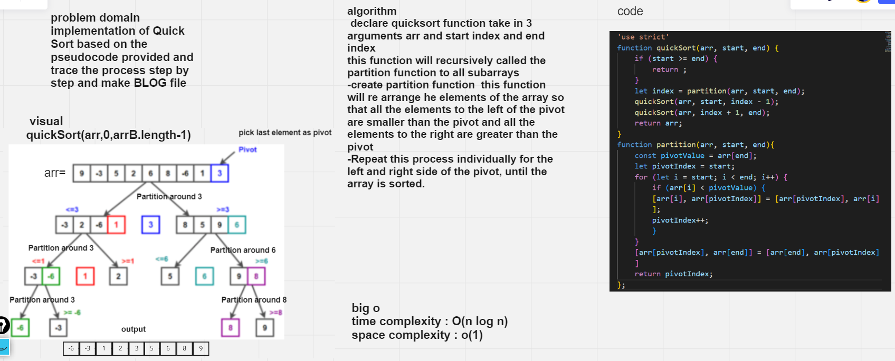

# Challenge Summary
implementation of Quick Sort based on the pseudocode provided.and trace the process step by step and make BLOG file
The key process in quickSort is partition(). Target of partitions is, given an array and an element x of array as pivot, put x at its correct position in sorted array and put all smaller elements (smaller than x) before x, and put all greater elements (greater than x) after x. All this should be done in linear time.

## Whiteboard Process

## Approach & Efficiency

time complexity : O(n log n)
This is a divide-and-conquer algorithm, so, best case, it takes O(n log n) time—that’s n steps to partition the array, log n times.
space complexity : o(1)
Since at any step in the process, it only swaps elements within the array, it uses O(1) space.