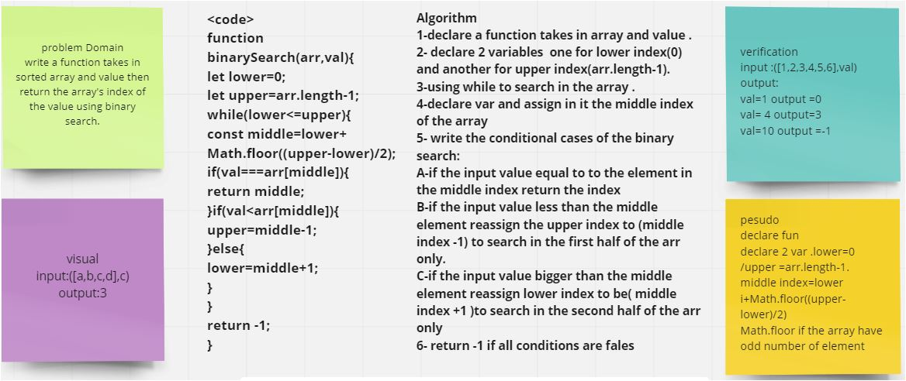

# Binary Search of Sorted Array
in this challenge we wrote a function takes in 2 parameters array and value and we need to search throgh the array if the value exisit the return its index and if the value doesnot exist return -1 
we used binary search in this challenge inisted of traditional sarech using for loop or map 

## Whiteboard Process

i changed the image 