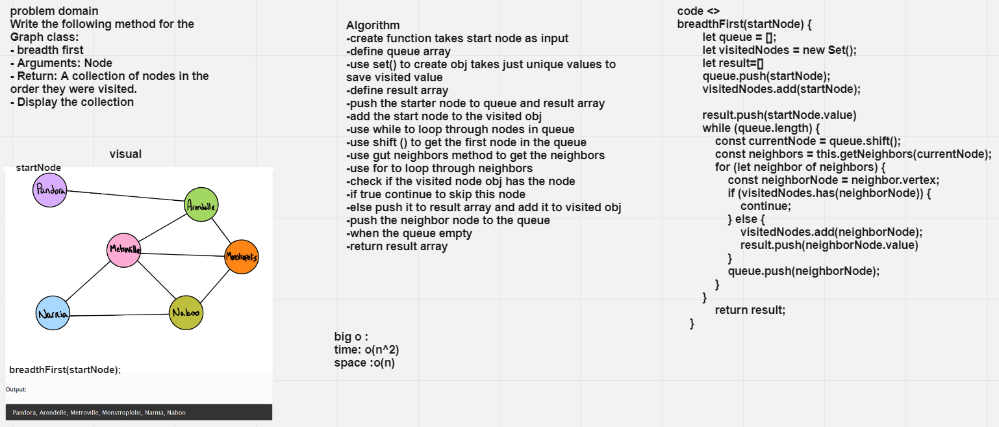

# Challenge Summary
Write the following method for the Graph class:

- breadth first
- Arguments: Node
- Return: A collection of nodes in the order they were visited.
- Display the collection

## Whiteboard Process

## Approach & Efficiency

big o:
time : o(n^2)
space :o(n)
