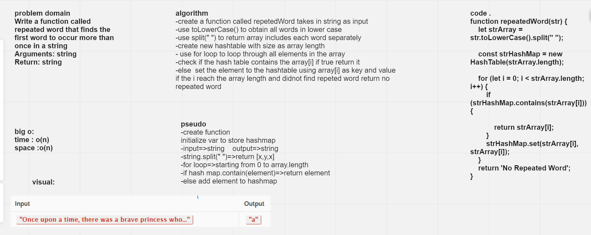
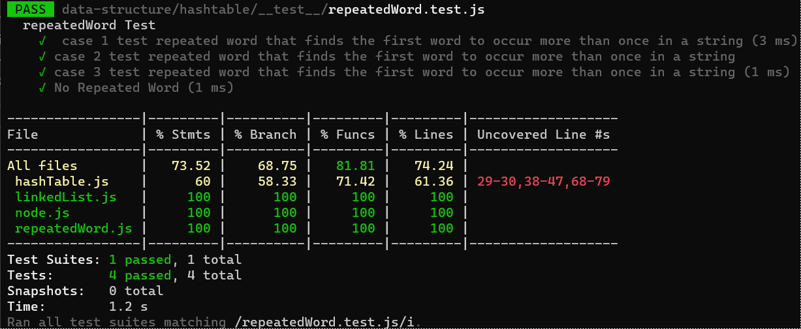

# Challenge Summary

Write a function called repeated word that finds the first word to occur more than once in a string  
Arguments: string  
Return: string  
## Whiteboard Process

## Approach & Efficiency
big o :  
time :o(n)  
space: o(n)

## Solution

