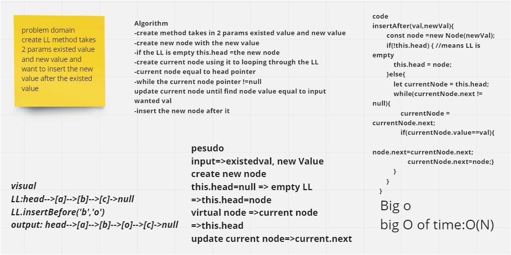

# Singly Linked List
we learn how to creat linkedlist and insert to it nodes insted of using arrarys

## Challenge
in this challenge we creat node class and linkedlist class  and creat 3 methodes for the linked list and test each method 

## Description of each method
- insert methode:
this methode using for insert node tolinkedlist 
first of all we check if the likedlist is empty or not then use block of code for each case to insert node.
- includes methode
this methode using for check if sertin value exist in the linkedlist or not and return true if exist or false if not so i used while to looping throgh the linkedlist values and check each one if it same as the value i search for
- to string methode 
this methode using for  assigne all values in linkedlist in var as string in specific formate so i used while to loop throgh the linkedlist value and assigne in in var and then return the var

===============
in this challenge 06 
Description of each method
append :write linkedlist methode take value as input and add it as a node to the end of the likedlist, 
append

insert before: write LL method takes 2 parameters new node and existed node and we want to insert the new node before the existed node 
insert before 

insert after :create LL method takes 2 params existed value and new value and want to insert the new value after the existed value 

================ 
challenge 08  
this challenge about  write function takes in two linked list as input and return new zipped linkedlist  

==============
in this challenge 06
write linkedlist method take k as input and return and Return the node’s value that is k places from the tail of the linked list.

================
code challenge 10
## challenge
in this challenge learned Queue implementation using linked list and stack implementation using linked list in javascript

## Approach & Efficiency
in all methode i write for both stack and queue its o(1) time complexity

## API
the methodes 
stack methodes :
push : its push  new value to the stack 
pop : its pop the last value in the stack
isEmpty: return true if the stack is impty or fale if the stack is not empty
peek: its return the top value of the stak 

queue methodes :
enqueue: its insert a new node in th rear of the queue 
decueue: its pop node from the front of the queue 
peek: its return the first node in the queue 
isEmpty : its return true when the queue is empty and false when the queue is not empty 
