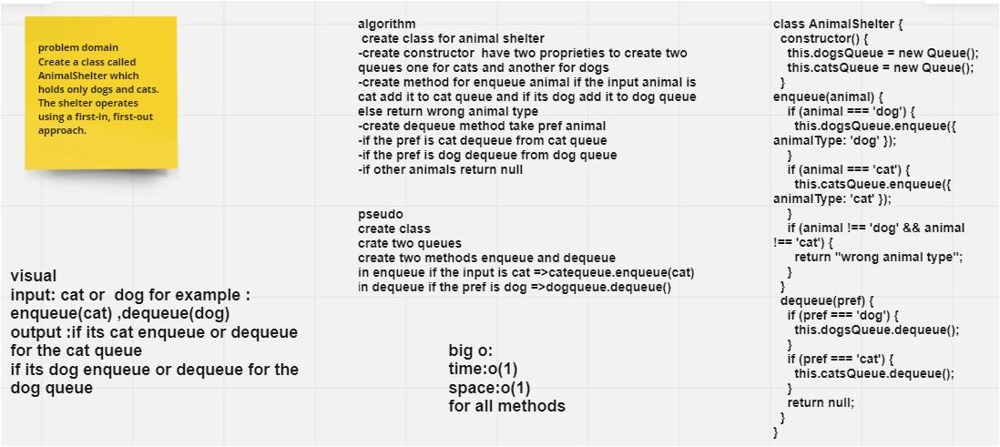
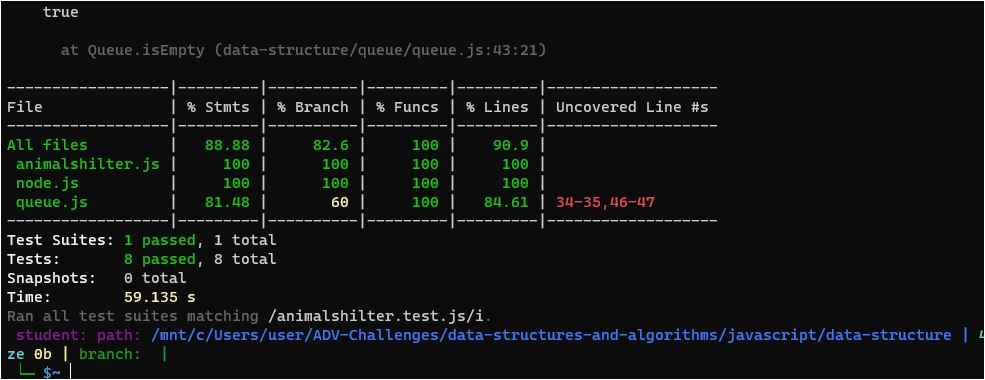

# Challenge Summary

Create a AnimalShelter class that takes in dog and cat objects. Class has a method to enqueue and dequeue dogs and cats.
## Whiteboard Process

## Approach & Efficiency
all methodes i used in this vhallenge (enqueue and dequeue) are big o(1) time and big o(1) space

## Solution
