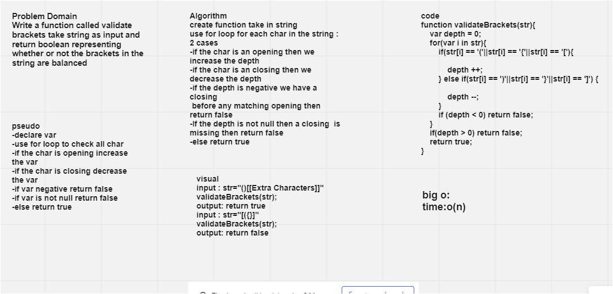

# Challenge Summary
Write a function called validate brackets take string as input and return boolean representing whether or not the brackets in the string are balanced

## Whiteboard Process

## Approach & Efficiency
big o of time : o(n)