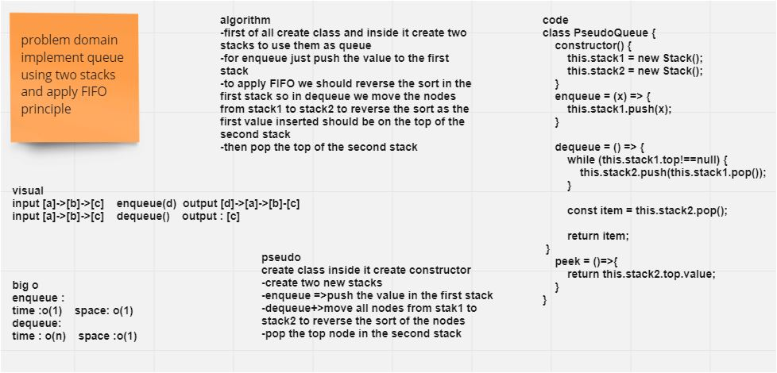
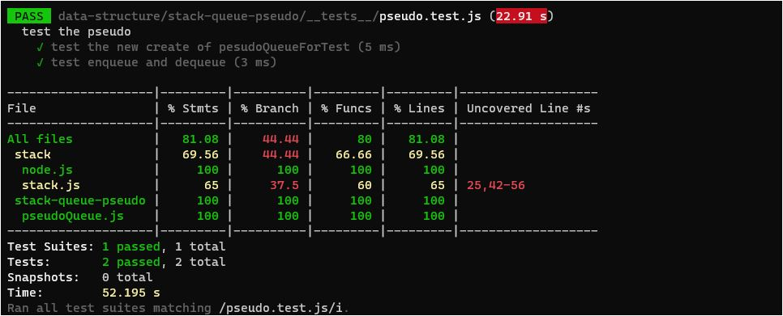

# Code Challenge: Class 11
## Challenge Summary
> Implemented a Queue using two Stacks, I want to make two stacks that give me the same result queue(FIFO/LILO).
## Whiteboard Process

## Approach & Efficiency
>I made a new class pesoudoQueue and constructor instance two stacks, apply on them all previous methods. then I create two methods inside this class.
> enqueue :
> to push value in stack one
* Time complexity = Big O (1)
* space complexity = Big O (1)
> dequeue :
> use while loop to check stack one and
>loop inside and transfer data from stack one for the stack to
>using two methods push and pop()
* Time complexity = Big O (n)
* space complexity = Big O (1).
## Solution

* "test": "jest --verbose --coverage"
* npm test pesudoQueue.test.js