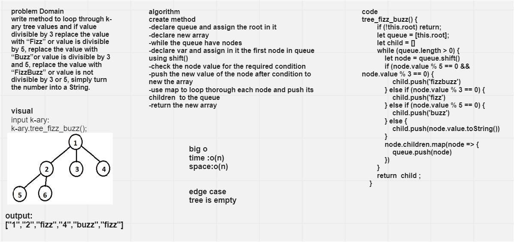

# Challenge Summary
write method to loop through k-ary tree values and if value divisible by 3 replace the value with “Fizz” or value is divisible by 5, replace the value with “Buzz”or value is divisible by 3 and 5, replace the value with “FizzBuzz” or value is not divisible by 3 or 5, simply turn the number into a String.

## Whiteboard Process

## Approach & Efficiency
- If the value is divisible by 3, replace the value with “Fizz”
- If the value is divisible by 5, replace the value with “Buzz”
- If the value is divisible by 3 and 5, replace the value with “FizzBuzz”
- If the value is not divisible by 3 or 5, simply turn the number into a String.
 

* push(): Big O (1)
* shift(): Big O (n)
* toString() :Big O(1)
* map : Big O (n)
* Time O(n)
* Space 0(n)
