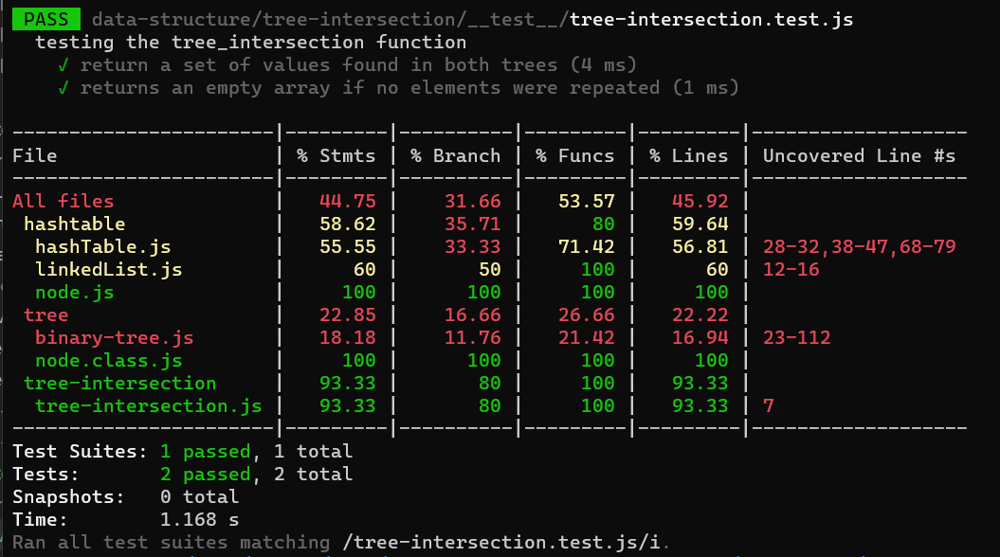

# Challenge Summary
Write a function called tree_intersection that takes two binary trees as parameters.
Using your Hashmap implementation as a part of your algorithm, return a set of values found in both trees.
## Whiteboard Process

## Approach & Efficiency
Approach:
-create function takes in two binary tree as input
-use preOrder() method on each tree to return array includes all node in the both input trees array of nodes for each tree
-check the length of each array 
-create new instance of hashTable with the size of the longest array
-create result array to assign in it the common nodes 
-map on one of the nodes arrays and set all nodes in hashtable 
-then map on the other nodes array and for each element check if the hashtable contain the same element if true push the element to the result array .
-return result array that is contain all common elements
big o:
time: o(n^2) 
space:o(n)

## Solution
