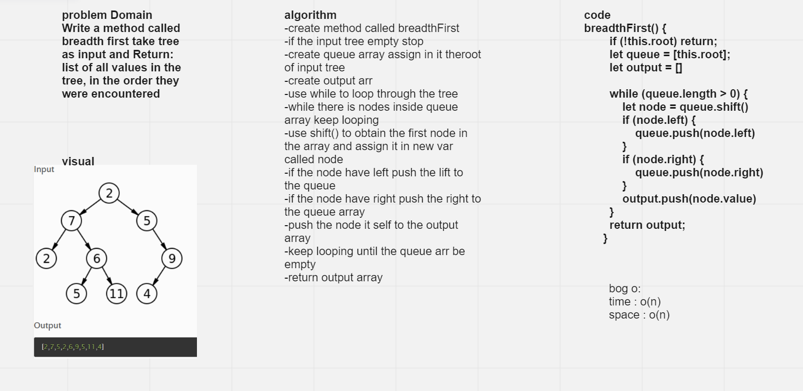

# Challenge Summary
Write a method called breadth first take tree as input and Return: list of all values in the tree, in the order they were encountered

## Whiteboard Process

## Approach & Efficiency
i use while to loop through each node and push it into output array
bog o :
time o(n)
space o(n)